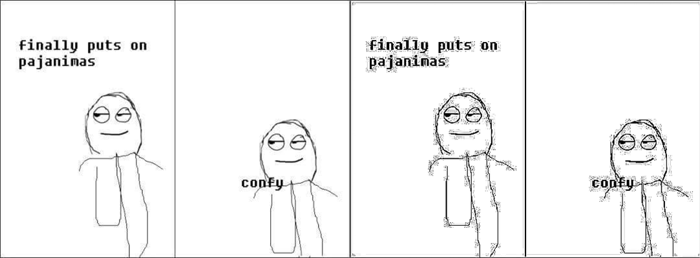
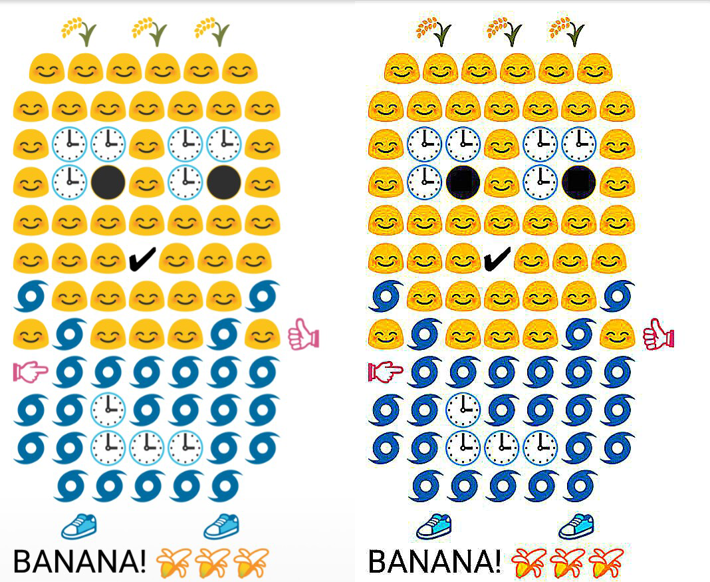
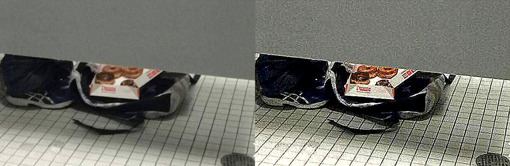
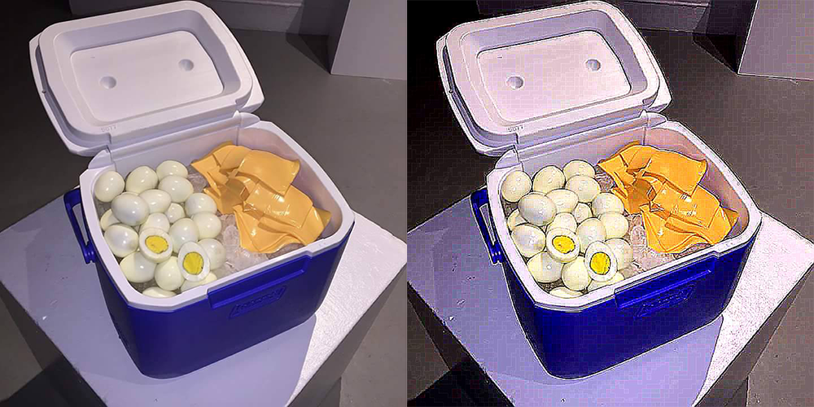

# Ghetto-filter

Ghetto-filter is a little Python CLI tool that "ghetto-ifies" an image.
It runs on Python 3.4(.2).


## Sample Images

Original is on the left and the ghetto-ified is on the right






## Usage
Like [my last repo](https://github.com/Chaquator/turbo-meme-generator), I'm letting argparse make the usage for me.
```
usage: ghetto_filter.py [-h] -i file [-sh float] [-co float] [-cf float]
                        [-q int] [-r int]
                        output

Ghetto Filter for image

positional arguments:
  output

optional arguments:
  -h, --help            show this help message and exit
  -i file, --input file
                        Input file (Required)
  -sh float, --sharpness float
                        Default: 15.0; Sharpness for the image
  -co float, --contrast float
                        Default: 1.25; Contrast for the image
  -cf float, --color-factor float
                        Default: 1.25; 0.0 represents black and white; 1.0
                        represents full, original color; and going further
                        increases the vibrance of the color.
  -q int, --quality int
                        Default: 65; Quality of output jpeg from 0 to 100
  -r int, --repetitions int
                        Default: 1; How many times you want to apply the
                        specified settings to the image.
```

## Install
You can either download this repo or just check [releases](https://github.com/Chaquator/ghetto-filter/releases)
						
## Build
Run `setup.py` inside the directory to compile it into a single `.exe` file. 

If you are building from source, here are the dependencies (that aren't included in a standard install of Python 3.4.2):
- [py2exe](http://www.py2exe.org/) (only if you plan to build with `setup.py` obviously)
- [Pillow](https://python-pillow.github.io/) (fork of old PIL, updated for Python 3.4)

## Licenses
what?